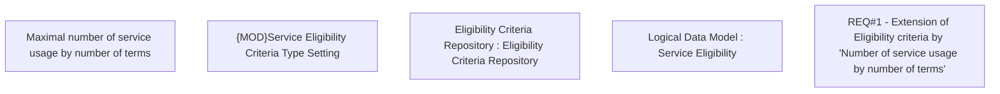

# CBL-9909 (CSI-168) Additional checks in PAYHOL process

```mermaid
graph TD
    Maximal_number_of_service_usage_by_number_of_terms["Maximal number of service usage by number of terms"]
    MOD_Service_Eligibility_Criteria_Type_Setting["{MOD}Service Eligibility Criteria Type Setting"]
    Eligibility_Criteria_Repository_Eligibility_Criteria_Reposit["Eligibility Criteria Repository : Eligibility Criteria Repository"]
    Logical_Data_Model_Service_Eligibility["Logical Data Model : Service Eligibility"]
    REQ_1_Extension_of_Eligibility_criteria_by_Number_of_service["REQ#1 - Extension of Eligibility criteria by 'Number of service usage by number of terms'"]
```
