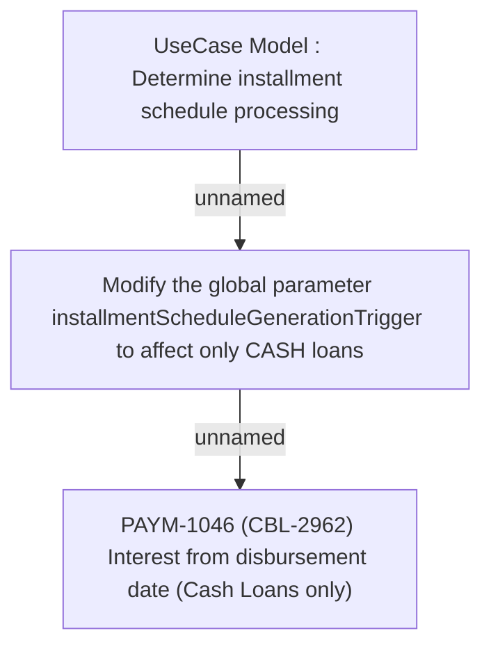

# PAYM-1046 (CBL-2962) Interest from disbursement date (Cash Loans only)

- **Diagram Type**: Custom
- **Package**: HomerSelect/BSL/Requirements Model/Finished/ISPAY/PAYM-1046 (CBL-2962) Interest from disbursement date (Cash Loans only)
- **Diagram ID**: 113630
- **Elements**: 3
- **Connectors**: 2

