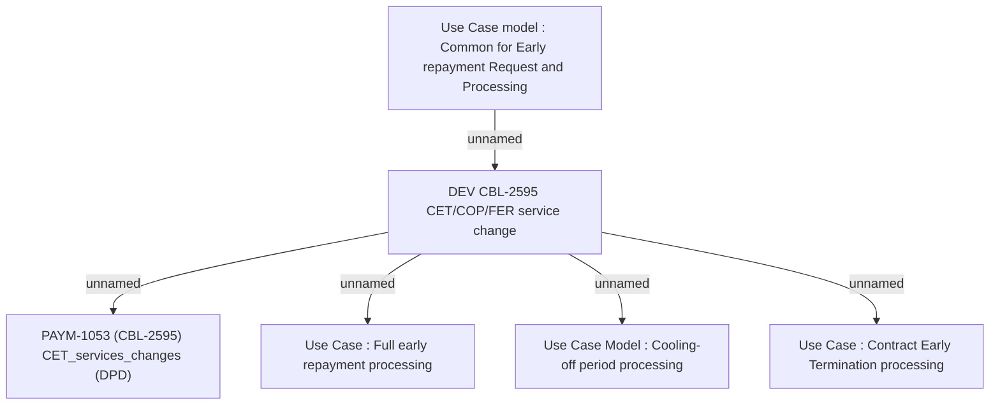

# PAYM-1053 (CBL-2595) CET_services_changes (DPD)

- **Diagram Type**: Custom
- **Package**: HomerSelect/BSL/Requirements Model/Finished/ISPAY/PAYM-1053 (CBL-2595) CET_services_changes (DPD)
- **Diagram ID**: 113734
- **Elements**: 6
- **Connectors**: 5

