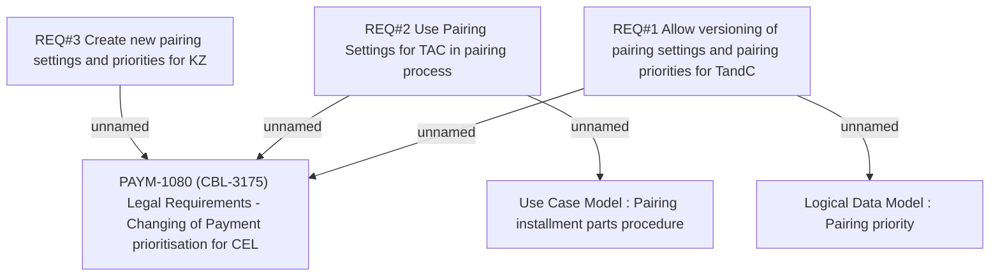

# PAYM-1080 (CBL-3175) Legal Requirements - Changing of Payment prioritisation for CEL

- **Diagram Type**: Custom
- **Package**: HomerSelect/BSL/Requirements Model/Finished/ISPAY/PAYM-1080 (CBL-3175) Legal Requirements - Changing of Payment prioritisation for CEL
- **Diagram ID**: 113631
- **Elements**: 6
- **Connectors**: 5

