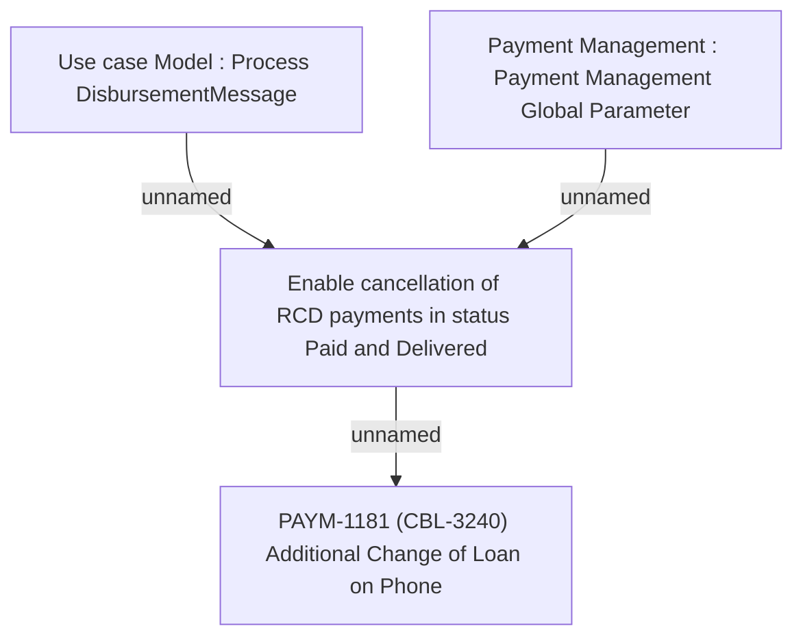

# PAYM-1181 (CBL-3240) Additional Change of Loan on Phone

```mermaid
graph TD
    Payment_Management_Payment_Management_Global_Parameter["Payment Management : Payment Management Global Parameter"]
    Use_case_Model_Process_DisbursementMessage["Use case Model : Process DisbursementMessage"]
    Enable_cancellation_of_RCD_payments_in_status_Paid_and_Deliv["Enable cancellation of RCD payments in status Paid and Delivered"]
    PAYM_1181_CBL_3240_Additional_Change_of_Loan_on_Phone["PAYM-1181 (CBL-3240) Additional Change of Loan on Phone"]
    Enable_cancellation_of_RCD_payments_in_status_Paid_and_Deliv -->|unnamed| PAYM_1181_CBL_3240_Additional_Change_of_Loan_on_Phone
    Use_case_Model_Process_DisbursementMessage -->|unnamed| Enable_cancellation_of_RCD_payments_in_status_Paid_and_Deliv
    Payment_Management_Payment_Management_Global_Parameter -->|unnamed| Enable_cancellation_of_RCD_payments_in_status_Paid_and_Deliv
```
