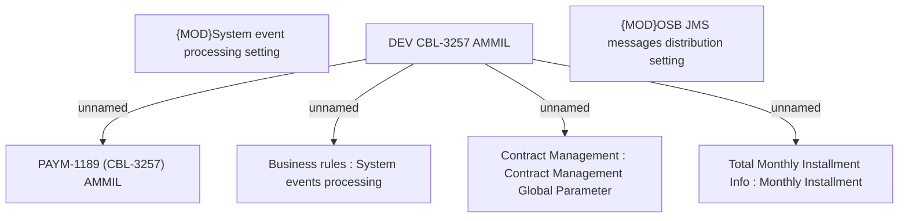

# PAYM-1189 (CBL-3257) AMMIL

```mermaid
graph TD
    Contract_Management_Contract_Management_Global_Parameter["Contract Management : Contract Management Global Parameter"]
    Total_Monthly_Installment_Info_Monthly_Installment["Total Monthly Installment Info : Monthly Installment"]
    Business_rules_System_events_processing["Business rules : System events processing"]
    MOD_System_event_processing_setting["{MOD}System event processing setting"]
    DEV_CBL_3257_AMMIL["DEV CBL-3257 AMMIL"]
    PAYM_1189_CBL_3257_AMMIL["PAYM-1189 (CBL-3257) AMMIL"]
    MOD_OSB_JMS_messages_distribution_setting["{MOD}OSB JMS messages distribution setting"]
    DEV_CBL_3257_AMMIL -->|unnamed| PAYM_1189_CBL_3257_AMMIL
    DEV_CBL_3257_AMMIL -->|unnamed| Business_rules_System_events_processing
    DEV_CBL_3257_AMMIL -->|unnamed| Contract_Management_Contract_Management_Global_Parameter
    DEV_CBL_3257_AMMIL -->|unnamed| Total_Monthly_Installment_Info_Monthly_Installment
```
