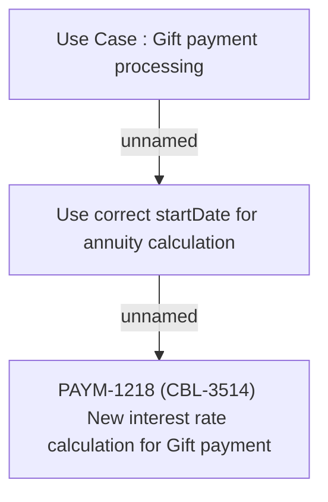

# PAYM-1218 (CBL-3514) New interest rate calculation for Gift payment

- **Diagram Type**: Custom
- **Package**: HomerSelect/BSL/Requirements Model/Finished/ISPAY/PAYM-1218 (CBL-3514) New interest rate calculation for Gift payment
- **Diagram ID**: 113737
- **Elements**: 3
- **Connectors**: 2

