# PAYM-1410 (CBL-3666) Standalone insurance

- **Diagram Type**: Custom
- **Package**: HomerSelect/BSL/Requirements Model/Finished/ISPAY/PAYM-1410 (CBL-3666) Standalone insurance
- **Diagram ID**: 113849
- **Elements**: 44
- **Connectors**: 15

```mermaid
graph TD
    n_05_182_Pair_payment_with_contract["05.182 Pair payment with contract"]
    n_01_474_Calculate_CEL_debt_info["01.474 Calculate CEL debt info"]
    n_05_295_Pair_incoming_payments_from_file["05.295 Pair incoming payments from file"]
    MOD_05_183_Process_batch_of_incoming_payment_processing_requ["{MOD}05.183 Process batch of incoming payment processing requests"]
    n_05_047_Perform_incoming_payment_cancellation_tasks["05.047 Perform  incoming payment cancellation tasks"]
    n_05_080_Create_incoming_payment_manually["05.080 Create incoming payment manually"]
    External_Reference["External Reference"]
    n_05_183_Process_batch_of_incoming_payment_processing_reques["05.183 Process batch of incoming payment processing requests"]
    External_Reference["External Reference"]
    External_Reference["External Reference"]
    n_05_045_Cancel_incoming_payment["05.045 Cancel incoming payment"]
    Logical_data_model_Others["Logical data model : Others"]
    Tab_Payment_channels_Tab_Payment_channels["Tab-Payment channels : Tab-Payment channels"]
    Use_Case_Model_Cancel_contract_manually_Use_case_diagram["Use Case Model : Cancel contract manually - Use case diagram"]
    User_Interface_model_Browse_outgoing_payments_screen["User Interface model : Browse outgoing payments screen"]
    UseCase_Model_Contract_debt_tracking["UseCase Model : Contract debt tracking"]
    Debt_catalogue["Debt catalogue"]
    Change_disbursement_channel["Change disbursement channel"]
    Change_repayment_channel["Change repayment channel"]
    n_05_061_Decouple_incoming_payments_from_IS_on_local_request["05.061 Decouple incoming payments from IS on local request"]
    n_05_182_Pair_payment_with_contract["05.182 Pair payment with contract"]
    n_05_060_Decouple_incoming_payment_manually["05.060 Decouple incoming payment manually"]
    n_05_030_Couple_incoming_payment_manually["05.030 Couple incoming payment manually"]
    n_05_045_Cancel_incoming_payment["05.045 Cancel incoming payment"]
    REQ_3_Incoming_payment_support_for_SAI_contract["REQ#3 Incoming payment support for SAI contract"]
    Determinate_Transaction_Code_for_Outgoing_payment["Determinate Transaction Code for Outgoing payment"]
    Cancellation_after_disbursement_check["Cancellation after disbursement check"]
    UseCase_model_Process_internal_system_events_and_notificatio["UseCase model : Process internal system events and notifications for outgoing payments"]
    Use_Case_Model_Generate_and_Cancel_outgoing_payments["Use Case Model : Generate and Cancel outgoing payments"]
    Use_Case_Model_Cooling_off_period_processing["Use Case Model : Cooling-off period processing"]
    REQ_4_Support_new_contract_product_type_in_the_code["REQ#4 Support new contract/product type in the code"]
    DEL_05_237_Process_outgoing_payments_for_ContractRegistratio["{DEL}05.237 Process outgoing payments for ContractRegistrationSE"]
    n_05_236_Process_outgoing_payments_for_ContractPackageReceiv["05.236 Process outgoing payments for ContractPackageReceivedSE"]
    MOD_Generate_outgoing_payment_for_contract["{MOD}Generate outgoing payment for contract"]
    MOD_05_090_Generate_outgoing_payment_for_contract["{MOD}05.090 Generate outgoing payment for contract"]
    REQ_2_Generate_PTR_payment_for_SAI_contract["REQ#2 Generate PTR payment for SAI contract"]
    Use_Case_Model_Generate_installment_schedule["Use Case Model : Generate installment schedule"]
    Generate_installment_schedule_Basic_algorithm["Generate installment schedule - Basic algorithm"]
    REQ_1_Update_basic_IS_algorithm_to_comply_with_SAI_product_t["REQ#1 Update basic IS algorithm to comply with SAI product type"]
    PAYM_1410_CBL_3666_Standalone_insurance["PAYM-1410 (CBL-3666) Standalone insurance"]
    REQ_3["REQ#3"]
    REQ_4["REQ#4"]
    REQ_1["REQ#1"]
    REQ_2["REQ#2"]
    REQ_4_Support_new_contract_product_type_in_the_code -->|unnamed| Use_Case_Model_Cancel_contract_manually_Use_case_diagram
    REQ_4_Support_new_contract_product_type_in_the_code -->|unnamed| User_Interface_model_Browse_outgoing_payments_screen
    REQ_4_Support_new_contract_product_type_in_the_code -->|unnamed| UseCase_Model_Contract_debt_tracking
    REQ_4_Support_new_contract_product_type_in_the_code -->|unnamed| Tab_Payment_channels_Tab_Payment_channels
    REQ_2_Generate_PTR_payment_for_SAI_contract -->|unnamed| Logical_data_model_Others
    REQ_2_Generate_PTR_payment_for_SAI_contract -->|unnamed| UseCase_model_Process_internal_system_events_and_notificatio
    REQ_2_Generate_PTR_payment_for_SAI_contract -->|unnamed| Use_Case_Model_Generate_and_Cancel_outgoing_payments
    REQ_2_Generate_PTR_payment_for_SAI_contract -->|unnamed| Use_Case_Model_Cooling_off_period_processing
    Use_Case_Model_Generate_installment_schedule -->|unnamed| REQ_1_Update_basic_IS_algorithm_to_comply_with_SAI_product_t
    REQ_2_Generate_PTR_payment_for_SAI_contract -->|unnamed| PAYM_1410_CBL_3666_Standalone_insurance
    REQ_4_Support_new_contract_product_type_in_the_code -->|unnamed| PAYM_1410_CBL_3666_Standalone_insurance
    REQ_1_Update_basic_IS_algorithm_to_comply_with_SAI_product_t -->|unnamed| PAYM_1410_CBL_3666_Standalone_insurance
    REQ_3_Incoming_payment_support_for_SAI_contract -->|unnamed| PAYM_1410_CBL_3666_Standalone_insurance
    MOD_05_090_Generate_outgoing_payment_for_contract -->|unnamed| MOD_Generate_outgoing_payment_for_contract
    n_05_236_Process_outgoing_payments_for_ContractPackageReceiv -->|unnamed| MOD_05_090_Generate_outgoing_payment_for_contract
```

