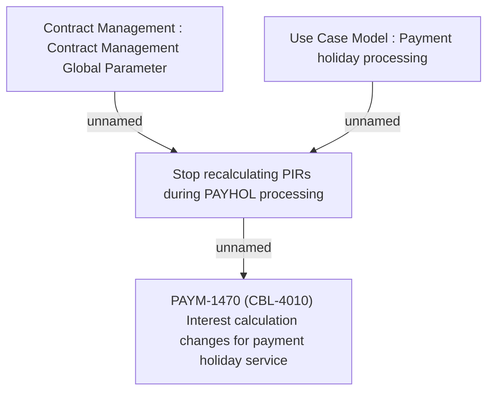

# PAYM-1470 (CBL-4010) Interest calculation changes for payment holiday service

- **Diagram Type**: Custom
- **Package**: HomerSelect/BSL/Requirements Model/Finished/ISPAY/PAYM-1470 (CBL-4010) Interest calculation changes for payment holiday service
- **Diagram ID**: 113993
- **Elements**: 4
- **Connectors**: 3

