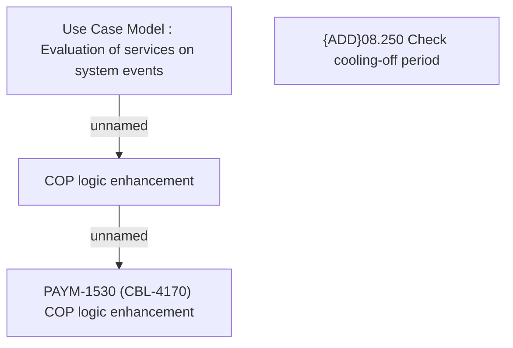

# PAYM-1530 (CBL-4170) COP logic enhancement

- **Diagram Type**: Custom
- **Package**: HomerSelect/BSL/Requirements Model/Finished/ISPAY/PAYM-1530 (CBL-4170) COP logic enhancement
- **Diagram ID**: 113992
- **Elements**: 4
- **Connectors**: 2

