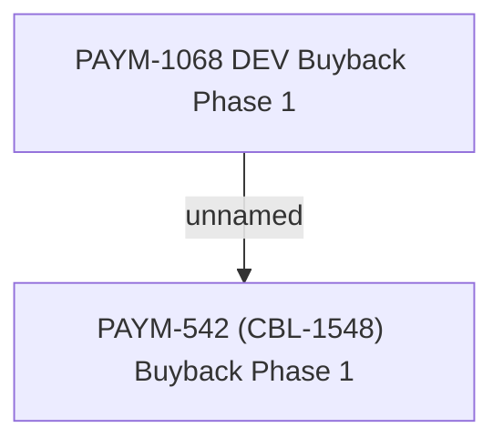

# PAYM-542 (CBL-1548) Buyback Phase 1

```mermaid
graph TD
    PAYM_1068_DEV_Buyback_Phase_1["PAYM-1068 DEV Buyback Phase 1"]
    PAYM_542_CBL_1548_Buyback_Phase_1["PAYM-542 (CBL-1548) Buyback Phase 1"]
    PAYM_1068_DEV_Buyback_Phase_1 -->|unnamed| PAYM_542_CBL_1548_Buyback_Phase_1
```
