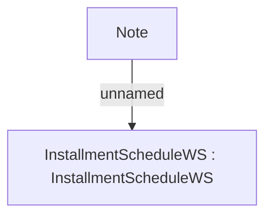

# CBL-237 Adding info about overpayments, prepayments, corrections, returns

- **Diagram Type**: Custom
- **Package**: HomerSelect/BSL/Requirements Model/Finished/IS/CBL-237 Adding info about overpayments, prepayments, corrections, returns
- **Diagram ID**: 105522
- **Elements**: 2
- **Connectors**: 1

