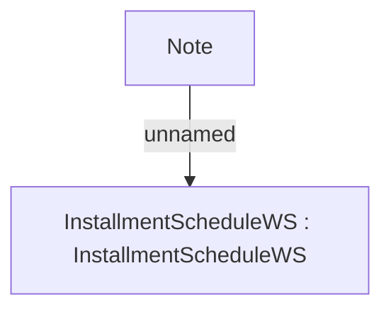

# CBL-237 Adding info about overpayments, prepayments, corrections, returns

```mermaid
graph TD
    el_1290914["Note"]
    InstallmentScheduleWS_InstallmentScheduleWS["InstallmentScheduleWS : InstallmentScheduleWS"]
    el_1290914 -->|unnamed| InstallmentScheduleWS_InstallmentScheduleWS
```
