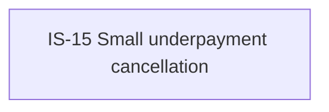

# IS-15 Small underpayment cancellation

- **Diagram Type**: Custom
- **Package**: HomerSelect/BSL/Requirements Model/Finished/IS/IS-15 (CBL-71) Small underpayment cancellation
- **Diagram ID**: 105523
- **Elements**: 1
- **Connectors**: 0

