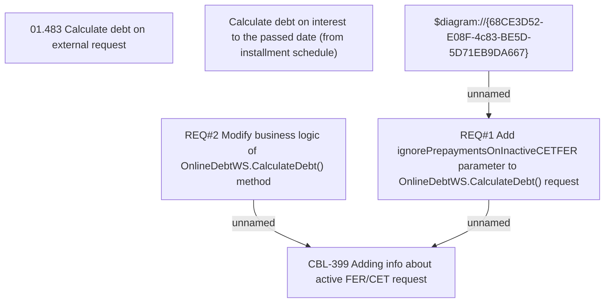

# IS-209 (CBL-399) Adding info about active FER/CET request

- **Diagram Type**: Custom
- **Package**: HomerSelect/BSL/Requirements Model/Finished/IS/IS-209 (CBL-399) Adding info about active FER/CET request
- **Diagram ID**: 105524
- **Elements**: 6
- **Connectors**: 3

