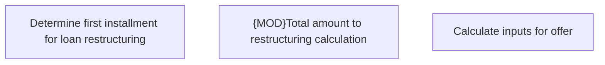

# IS-21 (CBL-6) Restructuring - Phase 1

- **Diagram Type**: Custom
- **Package**: HomerSelect/BSL/Requirements Model/Finished/IS/IS-21 (CBL-6) Restructuring - Phase 1
- **Diagram ID**: 105525
- **Elements**: 3
- **Connectors**: 0

