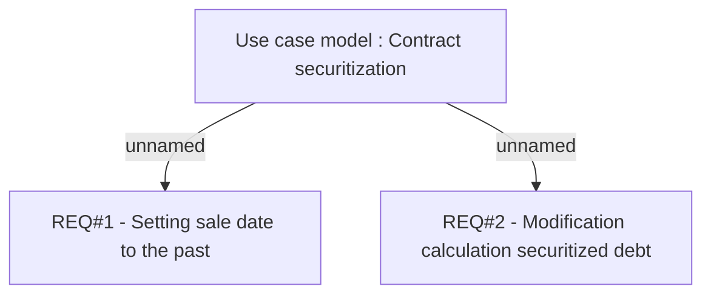

# IS-211 (CBL-1008) Securitization - Sale date in the past

```mermaid
graph TD
    REQ_2_Modification_calculation_securitized_debt["REQ#2 - Modification calculation securitized debt"]
    REQ_1_Setting_sale_date_to_the_past["REQ#1 - Setting sale date to the past "]
    Use_case_model_Contract_securitization["Use case model : Contract securitization"]
    Use_case_model_Contract_securitization -->|unnamed| REQ_1_Setting_sale_date_to_the_past
    Use_case_model_Contract_securitization -->|unnamed| REQ_2_Modification_calculation_securitized_debt
```
