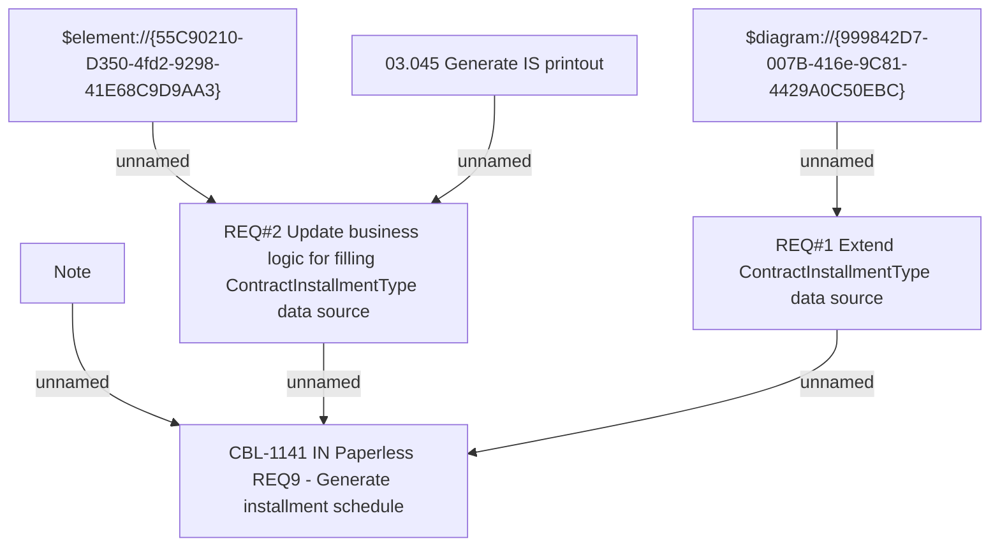

# IS-248 (CBL-1141) IN Paperless REQ9 - Generate installment schedule

```mermaid
graph TD
    n_03_045_Generate_IS_printout["03.045 Generate IS printout"]
    el_1290989["Note"]
    element_55C90210_D350_4fd2_9298_41E68C9D9AA3["$element://{55C90210-D350-4fd2-9298-41E68C9D9AA3}"]
    REQ_2_Update_business_logic_for_filling_ContractInstallmentT["REQ#2 Update business logic for filling ContractInstallmentType data source"]
    diagram_999842D7_007B_416e_9C81_4429A0C50EBC["$diagram://{999842D7-007B-416e-9C81-4429A0C50EBC}"]
    REQ_1_Extend_ContractInstallmentType_data_source["REQ#1 Extend ContractInstallmentType data source"]
    CBL_1141_IN_Paperless_REQ9_Generate_installment_schedule["CBL-1141 IN Paperless REQ9 - Generate installment schedule"]
    el_1290989 -->|unnamed| CBL_1141_IN_Paperless_REQ9_Generate_installment_schedule
    REQ_2_Update_business_logic_for_filling_ContractInstallmentT -->|unnamed| CBL_1141_IN_Paperless_REQ9_Generate_installment_schedule
    REQ_1_Extend_ContractInstallmentType_data_source -->|unnamed| CBL_1141_IN_Paperless_REQ9_Generate_installment_schedule
    diagram_999842D7_007B_416e_9C81_4429A0C50EBC -->|unnamed| REQ_1_Extend_ContractInstallmentType_data_source
    element_55C90210_D350_4fd2_9298_41E68C9D9AA3 -->|unnamed| REQ_2_Update_business_logic_for_filling_ContractInstallmentT
    n_03_045_Generate_IS_printout -->|unnamed| REQ_2_Update_business_logic_for_filling_ContractInstallmentT
```
