# IS-280 (CBL-1071) Improvement of CBL-58 Functionality

- **Diagram Type**: Custom
- **Package**: HomerSelect/BSL/Requirements Model/Finished/IS/IS-280 (CBL-1071) Improvement of CBL-58 Functionality
- **Diagram ID**: 105527
- **Elements**: 13
- **Connectors**: 16

```mermaid
graph TD
    Logical_Data_Model_Logical_Data_Model["Logical Data Model : Logical Data Model"]
    REQ_10_System_supports_generation_of_SMS_notification_messag["REQ#10 - System supports generation of SMS notification messages paramaters in following format: parameter ${title} --› 'Bpk' if customer is Male, 'Ibu' if customer is Female; ${paymentAmount} --› Rpx.xxx.xxx; ${nextDueDate} --› dd-mmm-yy"]
    UseCase_Model_SMS_notification["UseCase Model : SMS notification"]
    REQ_6_System_sends_SMS_notification_message_of_template_MSG_["REQ#6 - System sends SMS notification message of template MSG_PAYMENT_PAIRED_DPD"]
    REQ_5_System_sends_SMS_notification_message_of_template_MSG_["REQ#5 - System sends SMS notification message of template MSG_PAYMENT_PAIRED_DPD_0_PREPAYMENT"]
    REQ_4_System_send_SMS_notification_message_of_template_MSG_P["REQ#4 - System send SMS notification message of template MSG_PAYMENT_PAIRED_DPD_0_NO_PREPAYMENT"]
    REQ_1_System_supports_definition_of_SMS_notification_message["REQ#1 - System supports definition of SMS notification messages"]
    REQ_8_System_considers_only_STANDARD_installments_when_sendi["REQ#8 - System considers only STANDARD installments when sending SMS notification message for 'Update of Payment with DPD › 0' functionality"]
    REQ_9_System_creates_record_of_communication_event_when_SMS_["REQ#9 - System creates record of communication event when SMS is sent where Channel: Outgoing SMS (SMS), Type: General, Inquiries (GINQ), Subtype: Others (GI_OTHERS), Status: Delivered (DL), Result: Closed (CLS)"]
    REQ_7_System_supports_setting_of_SMS_priority_and_by_SMS_typ["REQ#7 - System supports setting of SMS priority and by SMS type for each country"]
    REQ_3_System_sends_SMS_notification_message_of_template_MSG_["REQ#3 - System sends SMS notification message of template MSG_PAYMENT_PAIRED to all contracts with remaining debt ‹= IDR 50 000."]
    REQ_2_System_notifies_clients_about_accepted_payment_immedia["REQ#2 - System notifies clients about accepted payment immediately by sending SMS message anytime within the whole day and week - 24/7 in Bahasa language"]
    CBL_1071_Improvement_of_CBL_58_Functionality_System_supports["CBL-1071 Improvement of CBL-58 Functionality: System supports on-line sending of SMS and email without DWH"]
    REQ_4_System_send_SMS_notification_message_of_template_MSG_P -->|unnamed| CBL_1071_Improvement_of_CBL_58_Functionality_System_supports
    REQ_10_System_supports_generation_of_SMS_notification_messag -->|unnamed| REQ_3_System_sends_SMS_notification_message_of_template_MSG_
    REQ_8_System_considers_only_STANDARD_installments_when_sendi -->|unnamed| CBL_1071_Improvement_of_CBL_58_Functionality_System_supports
    REQ_9_System_creates_record_of_communication_event_when_SMS_ -->|unnamed| CBL_1071_Improvement_of_CBL_58_Functionality_System_supports
    REQ_7_System_supports_setting_of_SMS_priority_and_by_SMS_typ -->|unnamed| CBL_1071_Improvement_of_CBL_58_Functionality_System_supports
    REQ_3_System_sends_SMS_notification_message_of_template_MSG_ -->|unnamed| CBL_1071_Improvement_of_CBL_58_Functionality_System_supports
    REQ_7_System_supports_setting_of_SMS_priority_and_by_SMS_typ -->|unnamed| REQ_1_System_supports_definition_of_SMS_notification_message
    Logical_Data_Model_Logical_Data_Model -->|unnamed| CBL_1071_Improvement_of_CBL_58_Functionality_System_supports
    REQ_10_System_supports_generation_of_SMS_notification_messag -->|unnamed| REQ_4_System_send_SMS_notification_message_of_template_MSG_P
    UseCase_Model_SMS_notification -->|unnamed| CBL_1071_Improvement_of_CBL_58_Functionality_System_supports
    REQ_6_System_sends_SMS_notification_message_of_template_MSG_ -->|unnamed| CBL_1071_Improvement_of_CBL_58_Functionality_System_supports
    REQ_5_System_sends_SMS_notification_message_of_template_MSG_ -->|unnamed| CBL_1071_Improvement_of_CBL_58_Functionality_System_supports
    REQ_2_System_notifies_clients_about_accepted_payment_immedia -->|unnamed| CBL_1071_Improvement_of_CBL_58_Functionality_System_supports
    REQ_10_System_supports_generation_of_SMS_notification_messag -->|unnamed| REQ_6_System_sends_SMS_notification_message_of_template_MSG_
    REQ_10_System_supports_generation_of_SMS_notification_messag -->|unnamed| REQ_5_System_sends_SMS_notification_message_of_template_MSG_
    REQ_1_System_supports_definition_of_SMS_notification_message -->|unnamed| CBL_1071_Improvement_of_CBL_58_Functionality_System_supports
```

