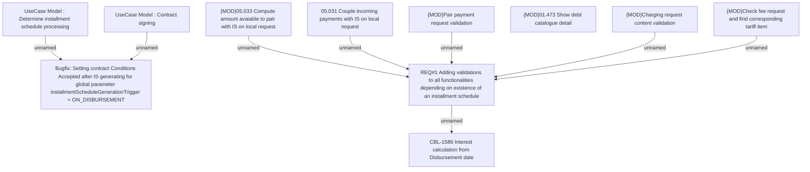

# IS-345 (CBL-1586) Interest calculation from Disbursement date

```mermaid
graph TD
    UseCase_Model_Determine_installment_schedule_processing["UseCase Model : Determine installment schedule processing"]
    UseCase_Model_Contract_signing["UseCase Model : Contract signing"]
    Bugfix_Setting_contract_Conditions_Accepted_after_IS_generat["Bugfix: Setting contract Conditions Accepted after IS generating for global parameter installmentScheduleGenerationTrigger = ON_DISBURSEMENT"]
    MOD_Pair_payment_request_validation["{MOD}Pair payment request validation"]
    n_05_031_Couple_incoming_payments_with_IS_on_local_request["05.031 Couple incoming payments with IS on local request"]
    MOD_05_033_Compute_amount_avaiable_to_pair_with_IS_on_local_["{MOD}05.033 Compute amount avaiable to pair with IS on local request"]
    REQ_1_Adding_validations_to_all_functionalities_depending_on["REQ#1 Adding validations to all functionalities depending on existence of an installment schedule"]
    CBL_1586_Interest_calculation_from_Disbursement_date["CBL-1586 Interest calculation from Disbursement date"]
    MOD_01_473_Show_debt_catalogue_detail["{MOD}01.473 Show debt catalogue detail"]
    MOD_Check_fee_request_and_find_corresponding_tariff_item["{MOD}Check fee request and find corresponding tariff item"]
    MOD_Charging_request_content_validation["{MOD}Charging request content validation"]
    REQ_1_Adding_validations_to_all_functionalities_depending_on -->|unnamed| CBL_1586_Interest_calculation_from_Disbursement_date
    UseCase_Model_Determine_installment_schedule_processing -->|unnamed| Bugfix_Setting_contract_Conditions_Accepted_after_IS_generat
    UseCase_Model_Contract_signing -->|unnamed| Bugfix_Setting_contract_Conditions_Accepted_after_IS_generat
    MOD_05_033_Compute_amount_avaiable_to_pair_with_IS_on_local_ -->|unnamed| REQ_1_Adding_validations_to_all_functionalities_depending_on
    n_05_031_Couple_incoming_payments_with_IS_on_local_request -->|unnamed| REQ_1_Adding_validations_to_all_functionalities_depending_on
    MOD_Pair_payment_request_validation -->|unnamed| REQ_1_Adding_validations_to_all_functionalities_depending_on
    MOD_Charging_request_content_validation -->|unnamed| REQ_1_Adding_validations_to_all_functionalities_depending_on
    MOD_Check_fee_request_and_find_corresponding_tariff_item -->|unnamed| REQ_1_Adding_validations_to_all_functionalities_depending_on
```
