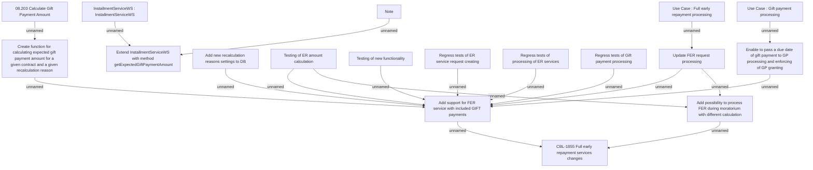

# IS-393 (CBL-1855) Full early repayment services changes

```mermaid
graph TD
    el_1290866["Note"]
    n_08_203_Calculate_Gift_Payment_Amount["08.203 Calculate Gift Payment Amount"]
    Create_function_for_calculating_expected_gift_payment_amount["Create function for calculating expected gift payment amount for a given contract and a given recalculation reason"]
    InstallmentServiceWS_InstallmentServiceWS["InstallmentServiceWS : InstallmentServiceWS"]
    Extend_InstallmentServiceWS_with_method_getExpectedGiftPayme["Extend InstallmentServiceWS with method getExpectedGiftPaymentAmount"]
    Add_new_recalculation_reasons_settings_to_DB["Add new recalculation reasons settings to DB"]
    Testing_of_ER_amount_calculation["Testing of ER amount calculation"]
    Use_Case_Full_early_repayment_processing["Use Case : Full early repayment processing"]
    Use_Case_Gift_payment_processing["Use Case : Gift payment processing"]
    Testing_of_new_functionality["Testing of new functionality"]
    Regress_tests_of_ER_service_request_creating["Regress tests of ER service request creating"]
    Regress_tests_of_processing_of_ER_services["Regress tests of processing of ER services"]
    Regress_tests_of_Gift_payment_processing["Regress tests of Gift payment processing"]
    CBL_1855_Full_early_repayment_services_changes["CBL-1855 Full early repayment services changes"]
    Add_possibility_to_process_FER_during_moratorium_with_differ["Add possibility to process FER during moratorium with different calculation"]
    Update_FER_request_processing["Update FER request processing"]
    Enable_to_pass_a_due_date_of_gift_payment_to_GP_processing_a["Enable to pass a due date of gift payment to GP processing and enforcing of GP granting"]
    Add_support_for_FER_service_with_included_GIFT_payments["Add support for FER service with included GIFT payments"]
    Regress_tests_of_processing_of_ER_services -->|unnamed| Add_support_for_FER_service_with_included_GIFT_payments
    el_1290866 -->|unnamed| Extend_InstallmentServiceWS_with_method_getExpectedGiftPayme
    InstallmentServiceWS_InstallmentServiceWS -->|unnamed| Extend_InstallmentServiceWS_with_method_getExpectedGiftPayme
    Add_possibility_to_process_FER_during_moratorium_with_differ -->|unnamed| CBL_1855_Full_early_repayment_services_changes
    Add_support_for_FER_service_with_included_GIFT_payments -->|unnamed| CBL_1855_Full_early_repayment_services_changes
    Testing_of_ER_amount_calculation -->|unnamed| Add_possibility_to_process_FER_during_moratorium_with_differ
    Update_FER_request_processing -->|unnamed| Add_possibility_to_process_FER_during_moratorium_with_differ
    Use_Case_Gift_payment_processing -->|unnamed| Enable_to_pass_a_due_date_of_gift_payment_to_GP_processing_a
    Enable_to_pass_a_due_date_of_gift_payment_to_GP_processing_a -->|unnamed| Add_support_for_FER_service_with_included_GIFT_payments
    Regress_tests_of_ER_service_request_creating -->|unnamed| Add_support_for_FER_service_with_included_GIFT_payments
    Testing_of_new_functionality -->|unnamed| Add_support_for_FER_service_with_included_GIFT_payments
    Regress_tests_of_Gift_payment_processing -->|unnamed| Add_support_for_FER_service_with_included_GIFT_payments
    Update_FER_request_processing -->|unnamed| Add_support_for_FER_service_with_included_GIFT_payments
    Testing_of_ER_amount_calculation -->|unnamed| Add_support_for_FER_service_with_included_GIFT_payments
    Add_new_recalculation_reasons_settings_to_DB -->|unnamed| Add_support_for_FER_service_with_included_GIFT_payments
    Create_function_for_calculating_expected_gift_payment_amount -->|unnamed| Add_support_for_FER_service_with_included_GIFT_payments
    Use_Case_Full_early_repayment_processing -->|unnamed| Update_FER_request_processing
    n_08_203_Calculate_Gift_Payment_Amount -->|unnamed| Create_function_for_calculating_expected_gift_payment_amount
```
