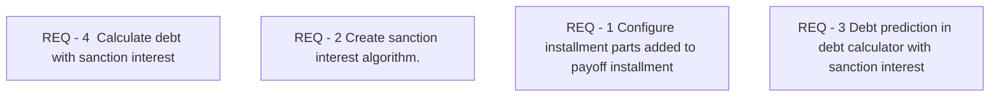

# IS-4 Interest rate of the overdue principal debt

- **Diagram Type**: Custom
- **Package**: HomerSelect/BSL/Requirements Model/Finished/IS/IS-4 (CBL-40) Interest rate of the overdue principal debt 
- **Diagram ID**: 105528
- **Elements**: 4
- **Connectors**: 0

