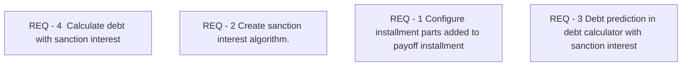

# IS-4 Interest rate of the overdue principal debt

```mermaid
graph TD
    REQ_4_Calculate_debt_with_sanction_interest["REQ - 4  Calculate debt with sanction interest"]
    REQ_2_Create_sanction_interest_algorithm["REQ - 2 Create sanction interest algorithm."]
    REQ_1_Configure_installment_parts_added_to_payoff_installmen["REQ - 1 Configure installment parts added to payoff installment"]
    REQ_3_Debt_prediction_in_debt_calculator_with_sanction_inter["REQ - 3 Debt prediction in debt calculator with sanction interest "]
```
