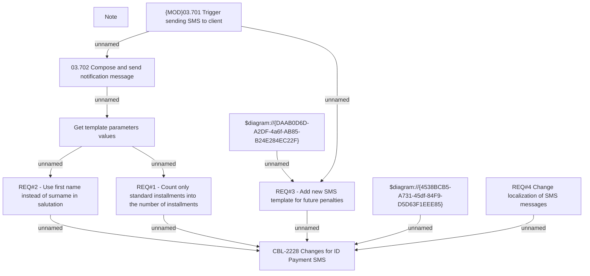

# IS-418 (CBL-2228) Changes for ID Payment SMS

- **Diagram Type**: Custom
- **Package**: HomerSelect/BSL/Requirements Model/Finished/IS/IS-418 (CBL-2228) Changes for ID Payment SMS
- **Diagram ID**: 105529
- **Elements**: 11
- **Connectors**: 11

