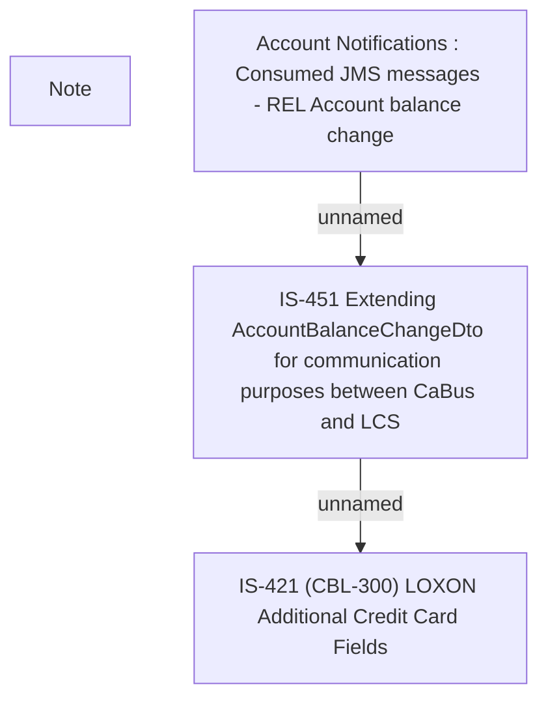

# IS-421 (CBL-300) LOXON Additional Credit Card Fields

```mermaid
graph TD
    el_1290883["Note"]
    Account_Notifications_Consumed_JMS_messages_REL_Account_bala["Account Notifications : Consumed JMS messages - REL Account balance change"]
    IS_451_Extending_AccountBalanceChangeDto_for_communication_p["IS-451 Extending AccountBalanceChangeDto for communication purposes between CaBus and LCS"]
    IS_421_CBL_300_LOXON_Additional_Credit_Card_Fields["IS-421 (CBL-300) LOXON Additional Credit Card Fields"]
    IS_451_Extending_AccountBalanceChangeDto_for_communication_p -->|unnamed| IS_421_CBL_300_LOXON_Additional_Credit_Card_Fields
    Account_Notifications_Consumed_JMS_messages_REL_Account_bala -->|unnamed| IS_451_Extending_AccountBalanceChangeDto_for_communication_p
```
