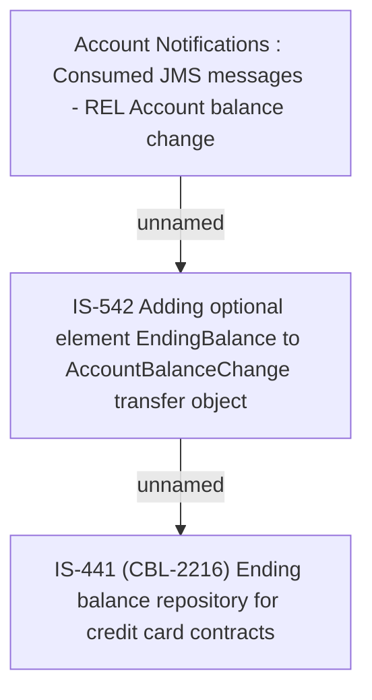

# IS-441 (CBL-2216) Ending balance repository for credit card contracts

```mermaid
graph TD
    Account_Notifications_Consumed_JMS_messages_REL_Account_bala["Account Notifications : Consumed JMS messages - REL Account balance change"]
    IS_542_Adding_optional_element_EndingBalance_to_AccountBalan["IS-542 Adding optional element EndingBalance to AccountBalanceChange transfer object"]
    IS_441_CBL_2216_Ending_balance_repository_for_credit_card_co["IS-441 (CBL-2216) Ending balance repository for credit card contracts"]
    IS_542_Adding_optional_element_EndingBalance_to_AccountBalan -->|unnamed| IS_441_CBL_2216_Ending_balance_repository_for_credit_card_co
    Account_Notifications_Consumed_JMS_messages_REL_Account_bala -->|unnamed| IS_542_Adding_optional_element_EndingBalance_to_AccountBalan
```
