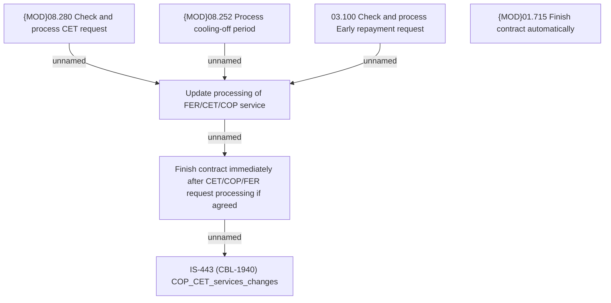

# IS-443 (CBL-1940) COP_CET_services_changes

```mermaid
graph TD
    MOD_08_252_Process_cooling_off_period["{MOD}08.252 Process cooling-off period"]
    n_03_100_Check_and_process_Early_repayment_request["03.100 Check and process Early repayment request"]
    MOD_08_280_Check_and_process_CET_request["{MOD}08.280 Check and process CET request"]
    Update_processing_of_FER_CET_COP_service["Update processing of FER/CET/COP service"]
    Finish_contract_immediately_after_CET_COP_FER_request_proces["Finish contract immediately after CET/COP/FER request processing if agreed"]
    IS_443_CBL_1940_COP_CET_services_changes["IS-443 (CBL-1940) COP_CET_services_changes"]
    MOD_01_715_Finish_contract_automatically["{MOD}01.715 Finish contract automatically"]
    Finish_contract_immediately_after_CET_COP_FER_request_proces -->|unnamed| IS_443_CBL_1940_COP_CET_services_changes
    Update_processing_of_FER_CET_COP_service -->|unnamed| Finish_contract_immediately_after_CET_COP_FER_request_proces
    MOD_08_280_Check_and_process_CET_request -->|unnamed| Update_processing_of_FER_CET_COP_service
    MOD_08_252_Process_cooling_off_period -->|unnamed| Update_processing_of_FER_CET_COP_service
    n_03_100_Check_and_process_Early_repayment_request -->|unnamed| Update_processing_of_FER_CET_COP_service
```
