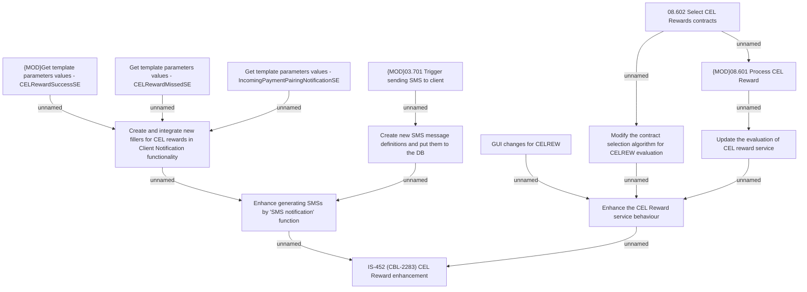

# IS-452 (CBL-2283) CEL Reward enhancement

- **Diagram Type**: Custom
- **Package**: HomerSelect/BSL/Requirements Model/Finished/IS/IS-452 (CBL-2283) CEL Reward enhancement
- **Diagram ID**: 105520
- **Elements**: 14
- **Connectors**: 14

