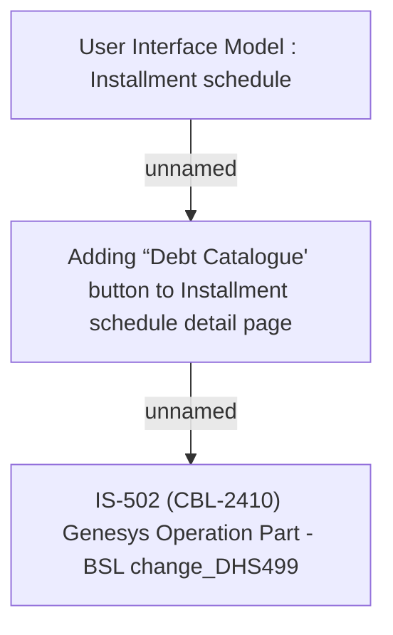

# IS-502 (CBL-2410) Genesys Operation Part - BSL change_DHS499

```mermaid
graph TD
    User_Interface_Model_Installment_schedule["User Interface Model : Installment schedule"]
    Adding_Debt_Catalogue_button_to_Installment_schedule_detail_["Adding “Debt Catalogue' button to Installment schedule detail page"]
    IS_502_CBL_2410_Genesys_Operation_Part_BSL_change_DHS499["IS-502 (CBL-2410) Genesys Operation Part - BSL change_DHS499"]
    Adding_Debt_Catalogue_button_to_Installment_schedule_detail_ -->|unnamed| IS_502_CBL_2410_Genesys_Operation_Part_BSL_change_DHS499
    User_Interface_Model_Installment_schedule -->|unnamed| Adding_Debt_Catalogue_button_to_Installment_schedule_detail_
```
