# IS-7 (CBL-29) Consolidation (Top up) for cash loans

- **Diagram Type**: Custom
- **Package**: HomerSelect/BSL/Requirements Model/Finished/IS/IS-7 (CBL-29) Consolidation (Top up) for cash loans
- **Diagram ID**: 105531
- **Elements**: 14
- **Connectors**: 11

```mermaid
graph TD
    PaymentPairingService["PaymentPairingService"]
    MOD_03_070_Calculate_early_repayment_amount["{MOD}03.070 Calculate early repayment amount"]
    MOD_03_110_Perform_early_repayment_installment_schedule["{MOD} 03.110 Perform early repayment installment schedule"]
    Creating_of_virtual_IS_for_FER_in_status_Paid_off["Creating of virtual IS for FER in status Paid-off"]
    Recalling_of_terminated_Installment_schedule["Recalling of terminated Installment schedule"]
    External_Reference["External Reference"]
    REQ_4_Payment_pairing_service["REQ#4 Payment pairing service"]
    External_Reference["External Reference"]
    REQ_3_Revert_Consolidation_FER_on_contract["REQ#3 - Revert Consolidation FER on contract"]
    Recalculation_Reason["Recalculation Reason"]
    MOD_01_766_Simulate_CEL_service_application_to_IS_on_local_r["{MOD}01.766 Simulate CEL service application to IS on local request"]
    ADD_CBL_29_IS_InstallmentServiceWS_InstallmentServiceWS["{ADD CBL-29 IS}InstallmentServiceWS : InstallmentServiceWS"]
    REQ_2_Evaluate_FER["REQ#2 - Evaluate FER"]
    REQ_1_Calculate_FER_amount["REQ#1 - Calculate FER amount"]
    REQ_1_Calculate_FER_amount -->|unnamed| ADD_CBL_29_IS_InstallmentServiceWS_InstallmentServiceWS
    REQ_1_Calculate_FER_amount -->|unnamed| MOD_01_766_Simulate_CEL_service_application_to_IS_on_local_r
    REQ_2_Evaluate_FER -->|unnamed| Recalculation_Reason
    REQ_2_Evaluate_FER -->|External Reference| External_Reference
    REQ_1_Calculate_FER_amount -->|External Reference| External_Reference
    REQ_3_Revert_Consolidation_FER_on_contract -->|unnamed| MOD_03_110_Perform_early_repayment_installment_schedule
    External_Reference -->|External Reference| MOD_03_070_Calculate_early_repayment_amount
    REQ_2_Evaluate_FER -->|unnamed| MOD_03_070_Calculate_early_repayment_amount
    REQ_4_Payment_pairing_service -->|unnamed| PaymentPairingService
    MOD_03_110_Perform_early_repayment_installment_schedule -->|unnamed| Recalling_of_terminated_Installment_schedule
    Creating_of_virtual_IS_for_FER_in_status_Paid_off -->|unnamed| Recalling_of_terminated_Installment_schedule
```

