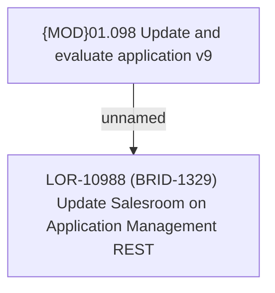

# LOR-10988 (BRID-1329) Update Salesroom on Application Management REST

- **Diagram Type**: Custom
- **Package**: HomerSelect/BSL/Requirements Model/Finished/LOR/LOR-10988 (BRID-1329) Update Salesroom on Application Management REST
- **Diagram ID**: 162787
- **Elements**: 2
- **Connectors**: 1

