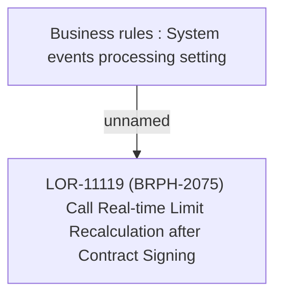

# LOR-11119 (BRPH-2075) Call Real-time Limit Recalculation after Contract Signing

```mermaid
graph TD
    Business_rules_System_events_processing_setting["Business rules : System events processing setting"]
    LOR_11119_BRPH_2075_Call_Real_time_Limit_Recalculation_after["LOR-11119 (BRPH-2075) Call Real-time Limit Recalculation after Contract Signing"]
    Business_rules_System_events_processing_setting -->|unnamed| LOR_11119_BRPH_2075_Call_Real_time_Limit_Recalculation_after
```
