# LOR-11243 (BRPH-2800) Discount Voucher: Apply Discounts in POS Loan Application

- **Diagram Type**: Custom
- **Package**: HomerSelect/BSL/Requirements Model/Finished/LOR/LOR-11243 (BRPH-2800) Discount Voucher: Apply Discounts in POS Loan Application
- **Diagram ID**: 164658
- **Elements**: 13
- **Connectors**: 7

```mermaid
graph TD
    ADD_Offer_Discount_Item["{ADD} Offer Discount Item"]
    Offer_Financial_Parameter["Offer Financial Parameter"]
    Financial_Parameter_Item_Type["Financial Parameter Item Type"]
    Customer_Offer_Recalculation_preferences["Customer Offer Recalculation - preferences"]
    MOD_Customer_Offer_Calculation_preferences["{MOD}Customer Offer Calculation - preferences"]
    v2_Financial_Parameters_v2["v2 : Financial Parameters v2"]
    CustomerOfferRestV2_CustomerOfferRestV2_GetCustomerOffer["CustomerOfferRestV2 : CustomerOfferRestV2 - GetCustomerOffer"]
    REQ_5_Check_all_jobs_for_deleting_OFP_to_delete_data_from_BS["REQ#5: Check all jobs for deleting OFP to delete data from BSL_OFFER_FIN_PAR_ITEM2DSC as well"]
    REQ_4_Put_discount_amount_into_input_of_product_calculation["REQ#4: Put discount amount into input of product calculation"]
    REQ_3_Update_BSL_REST_API_Financial_parameters_Endpoint_V2_G["REQ#3: Update BSL REST API Financial parameters Endpoint V2 GET /v2.0/financial-parameters/detail to be able to return discount code, discount amount and Discounted Total Goods Price in its response body "]
    REQ_2_Update_BSL_REST_API_Customer_Offer_GET_v2_0_customerOf["REQ#2: Update BSL REST API Customer Offer GET /v2.0/customerOffers to be able to return discount code, discount amount and Discounted Total Goods Price in its response body"]
    REQ_1_Update_BSL_REST_API_Customer_Offer_POST_v2_0_customerO["REQ#1: Update BSL REST API Customer Offer POST /v2.0/customerOffers/calculate and POST /v2.0/customerOffers/recalculate to be able to receive and save discount code and discount amount in its request body "]
    REQ_6_Update_BSL_DB["REQ#6: Update BSL DB "]
    ADD_Offer_Discount_Item -->|unnamed| REQ_6_Update_BSL_DB
    Offer_Financial_Parameter -->|unnamed| REQ_6_Update_BSL_DB
    Financial_Parameter_Item_Type -->|unnamed| REQ_6_Update_BSL_DB
    Customer_Offer_Recalculation_preferences -->|unnamed| REQ_4_Put_discount_amount_into_input_of_product_calculation
    MOD_Customer_Offer_Calculation_preferences -->|unnamed| REQ_4_Put_discount_amount_into_input_of_product_calculation
    v2_Financial_Parameters_v2 -->|unnamed| REQ_3_Update_BSL_REST_API_Financial_parameters_Endpoint_V2_G
    CustomerOfferRestV2_CustomerOfferRestV2_GetCustomerOffer -->|unnamed| REQ_2_Update_BSL_REST_API_Customer_Offer_GET_v2_0_customerOf
```

