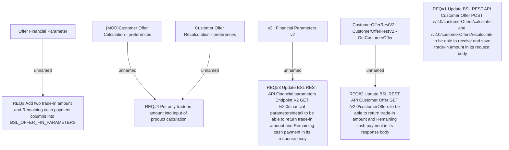

# LOR-11252 (BRPH-2797) Trade-In Amount as part of Down payment in BSL Product Calculator

- **Diagram Type**: Custom
- **Package**: HomerSelect/BSL/Requirements Model/Finished/LOR/LOR-11252 (BRPH-2797) Trade-In Amount as part of Down payment in BSL Product Calculator
- **Diagram ID**: 164659
- **Elements**: 10
- **Connectors**: 5

