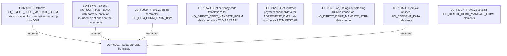

# LOR-6201 - Separate DSM from BSL

```mermaid
graph TD
    LOR_9328_Remove_unused_HO_CONSENT_DATA_elements["LOR-9328 - Remove unused HO_CONSENT_DATA elements"]
    LOR_9328_Remove_unused_HO_CONSENT_DATA_elements["LOR-9328 - Remove unused HO_CONSENT_DATA elements"]
    LOR_8969_Remove_global_parameter_HO_DDM_FORM_FROM_DSM["LOR-8969 - Remove global parameter HO_DDM_FORM_FROM_DSM"]
    LOR_8969_Remove_global_parameter_HO_DDM_FORM_FROM_DSM["LOR-8969 - Remove global parameter HO_DDM_FORM_FROM_DSM"]
    LOR_8940_Extend_HO_CONTRACT_DATA_with_barcode_prefix_of_incl["LOR-8940 - Extend HO_CONTRACT_DATA with barcode prefix of included client and contract documents"]
    LOR_8940_Extend_HO_CONTRACT_DATA_with_barcode_prefix_of_incl["LOR-8940 - Extend HO_CONTRACT_DATA with barcode prefix of included client and contract documents"]
    LOR_8578_Get_currency_code_translations_for_HO_DIRECT_DEBIT_["LOR-8578 - Get currency code translations for HO_DIRECT_DEBIT_MANDATE_FORM data source via CSD REST API"]
    LOR_8670_Get_contract_payment_channel_data_for_AGREEMENT_DAT["LOR-8670 - Get contract payment channel data for AGREEMENT_DATA data source via PAYM REST API"]
    LOR_8560_Adjust_logic_of_selecting_DDM_instance_for_HO_DIREC["LOR-8560 - Adjust logic of selecting DDM instance for HO_DIRECT_DEBIT_MANDATE_FORM data source"]
    LOR_8392_Retrieve_HO_DIRECT_DEBIT_MANDATE_FORM_data_source_f["LOR-8392 - Retrieve HO_DIRECT_DEBIT_MANDATE_FORM data source for documentation preparing from DSM"]
    LOR_8392_Retrieve_HO_DIRECT_DEBIT_MANDATE_FORM_data_source_f["LOR-8392 - Retrieve HO_DIRECT_DEBIT_MANDATE_FORM data source for documentation preparing from DSM"]
    LOR_8097_Remove_unused_HO_DIRECT_DEBIT_MANDATE_FORM_elements["LOR-8097 - Remove unused HO_DIRECT_DEBIT_MANDATE_FORM elements"]
    LOR_6201_Separate_DSM_from_BSL["LOR-6201 - Separate DSM from BSL"]
    LOR_8392_Retrieve_HO_DIRECT_DEBIT_MANDATE_FORM_data_source_f -->|unnamed| LOR_6201_Separate_DSM_from_BSL
    LOR_8940_Extend_HO_CONTRACT_DATA_with_barcode_prefix_of_incl -->|unnamed| LOR_6201_Separate_DSM_from_BSL
    LOR_8969_Remove_global_parameter_HO_DDM_FORM_FROM_DSM -->|unnamed| LOR_6201_Separate_DSM_from_BSL
    LOR_9328_Remove_unused_HO_CONSENT_DATA_elements -->|unnamed| LOR_6201_Separate_DSM_from_BSL
```
