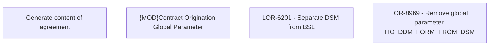

# LOR-8969 - Remove global parameter HO_DDM_FORM_FROM_DSM

- **Diagram Type**: Custom
- **Package**: HomerSelect/BSL/Requirements Model/Finished/LOR/LOR-6201 Separate DSM from BSL/LOR-8969 - Remove global parameter HO_DDM_FORM_FROM_DSM
- **Diagram ID**: 152297
- **Elements**: 4
- **Connectors**: 0

