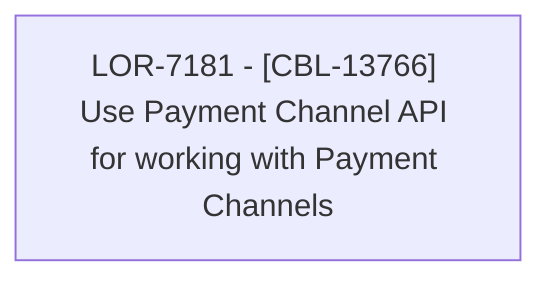

# LOR-7181 - [CBL-13766] Use Payment Channel API for working with Payment Channels

- **Diagram Type**: Custom
- **Package**: HomerSelect/BSL/Requirements Model/Finished/LOR/LOR-7181 - [CBL-13766] Use Payment Channel API for working with Payment Channels
- **Diagram ID**: 150312
- **Elements**: 1
- **Connectors**: 0

