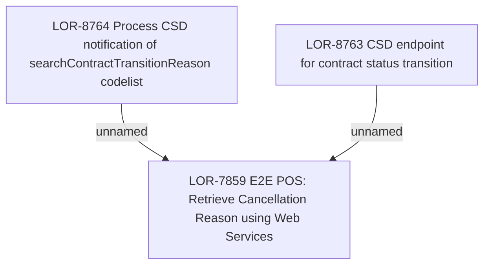

# LOR-7859 E2E POS: Retrieve Cancellation Reason using Web Services

```mermaid
graph TD
    LOR_8764_Process_CSD_notification_of_searchContractTransitio["LOR-8764 Process CSD notification of searchContractTransitionReason codelist"]
    LOR_8763_CSD_endpoint_for_contract_status_transition["LOR-8763 CSD endpoint for contract status transition"]
    LOR_7859_E2E_POS_Retrieve_Cancellation_Reason_using_Web_Serv["LOR-7859 E2E POS: Retrieve Cancellation Reason using Web Services"]
    LOR_8764_Process_CSD_notification_of_searchContractTransitio -->|unnamed| LOR_7859_E2E_POS_Retrieve_Cancellation_Reason_using_Web_Serv
    LOR_8763_CSD_endpoint_for_contract_status_transition -->|unnamed| LOR_7859_E2E_POS_Retrieve_Cancellation_Reason_using_Web_Serv
```
