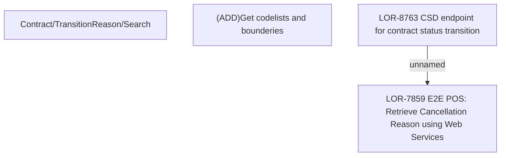

# LOR-8763 CSD endpoint for contract status transition

```mermaid
graph TD
    Contract_TransitionReason_Search["Contract/TransitionReason/Search"]
    ADD_Get_codelists_and_bounderies["(ADD)Get codelists and bounderies"]
    LOR_8763_CSD_endpoint_for_contract_status_transition["LOR-8763 CSD endpoint for contract status transition"]
    LOR_7859_E2E_POS_Retrieve_Cancellation_Reason_using_Web_Serv["LOR-7859 E2E POS: Retrieve Cancellation Reason using Web Services"]
    LOR_8763_CSD_endpoint_for_contract_status_transition -->|unnamed| LOR_7859_E2E_POS_Retrieve_Cancellation_Reason_using_Web_Serv
```
