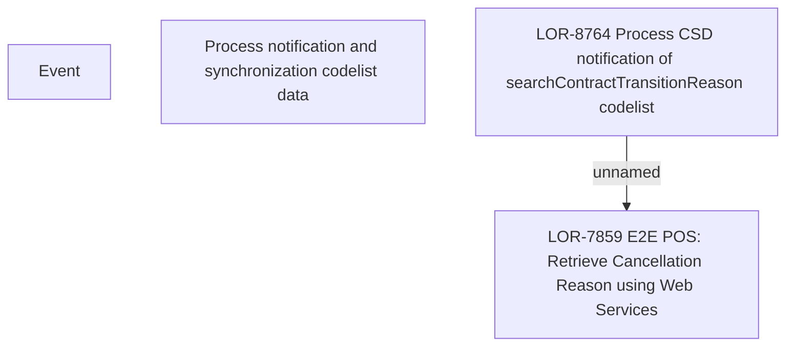

# LOR-8764 Process CSD notification of searchContractTransitionReason codelist

- **Diagram Type**: Custom
- **Package**: HomerSelect/BSL/Requirements Model/Finished/LOR/LOR-7859 E2E POS: Retrieve Cancellation Reason using Web Services/LOR-8764 Process CSD notification of searchContractTransitionReason codelist
- **Diagram ID**: 148010
- **Elements**: 4
- **Connectors**: 1

