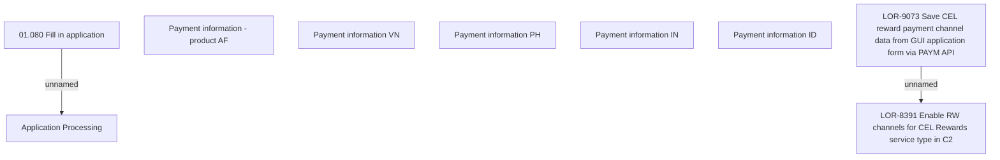

# LOR-9073 Save CEL reward payment channel data from GUI application form via PAYM API

- **Diagram Type**: Custom
- **Package**: HomerSelect/BSL/Requirements Model/Finished/LOR/LOR-8391 Enable RW channels for CEL Rewards service type in C2/LOR-9073 Save CEL reward payment channel data from GUI application form via PAYM API
- **Diagram ID**: 149311
- **Elements**: 9
- **Connectors**: 2

