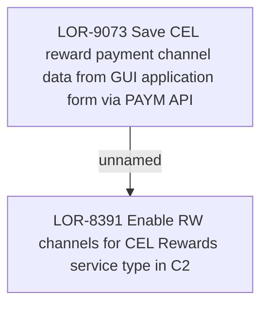

# LOR-8391 Enable RW channels for CEL Rewards service type in C2

```mermaid
graph TD
    LOR_9073_Save_CEL_reward_payment_channel_data_from_GUI_appli["LOR-9073 Save CEL reward payment channel data from GUI application form via PAYM API"]
    LOR_8391_Enable_RW_channels_for_CEL_Rewards_service_type_in_["LOR-8391 Enable RW channels for CEL Rewards service type in C2"]
    LOR_9073_Save_CEL_reward_payment_channel_data_from_GUI_appli -->|unnamed| LOR_8391_Enable_RW_channels_for_CEL_Rewards_service_type_in_
```
