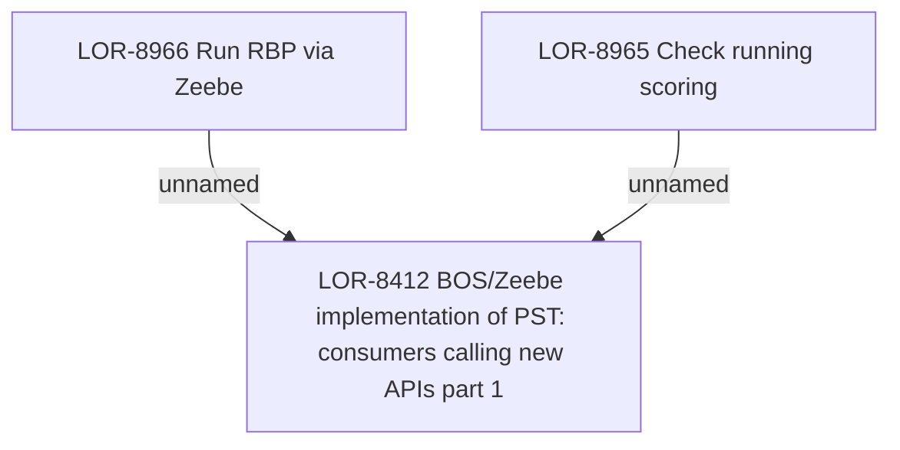

# LOR-8412 BOS/Zeebe implementation of PST: consumers calling new APIs part 1

- **Diagram Type**: Custom
- **Package**: HomerSelect/BSL/Requirements Model/Finished/LOR/LOR-8412 BOS/Zeebe implementation of PST: consumers calling new APIs part 1
- **Diagram ID**: 149761
- **Elements**: 3
- **Connectors**: 2

