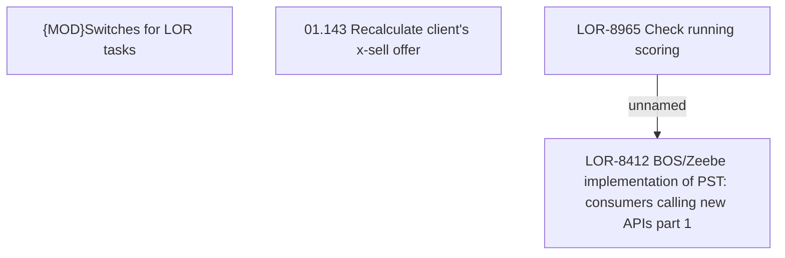

# LOR-8965 Check running scoring

- **Diagram Type**: Custom
- **Package**: HomerSelect/BSL/Requirements Model/Finished/LOR/LOR-8412 BOS/Zeebe implementation of PST: consumers calling new APIs part 1/LOR-8965 Check running scoring
- **Diagram ID**: 149762
- **Elements**: 4
- **Connectors**: 1

