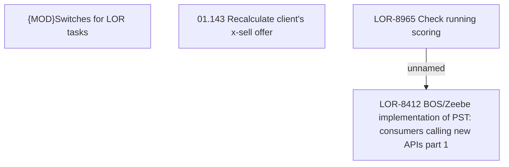

# LOR-8965 Check running scoring

```mermaid
graph TD
    MOD_Switches_for_LOR_tasks["{MOD}Switches for LOR tasks"]
    n_01_143_Recalculate_client_s_x_sell_offer["01.143 Recalculate client's x-sell offer"]
    LOR_8965_Check_running_scoring["LOR-8965 Check running scoring"]
    LOR_8412_BOS_Zeebe_implementation_of_PST_consumers_calling_n["LOR-8412 BOS/Zeebe implementation of PST: consumers calling new APIs part 1"]
    LOR_8965_Check_running_scoring -->|unnamed| LOR_8412_BOS_Zeebe_implementation_of_PST_consumers_calling_n
```
