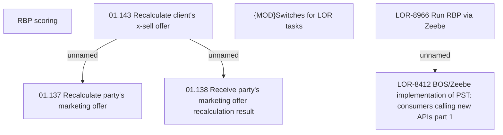

# LOR-8966 Run RBP via Zeebe

```mermaid
graph TD
    RBP_scoring["RBP scoring"]
    n_01_143_Recalculate_client_s_x_sell_offer["01.143 Recalculate client's x-sell offer"]
    MOD_Switches_for_LOR_tasks["{MOD}Switches for LOR tasks"]
    n_01_138_Receive_party_s_marketing_offer_recalculation_resul["01.138 Receive party's marketing offer recalculation result"]
    n_01_137_Recalculate_party_s_marketing_offer["01.137 Recalculate party's marketing offer"]
    LOR_8966_Run_RBP_via_Zeebe["LOR-8966 Run RBP via Zeebe"]
    LOR_8412_BOS_Zeebe_implementation_of_PST_consumers_calling_n["LOR-8412 BOS/Zeebe implementation of PST: consumers calling new APIs part 1"]
    LOR_8966_Run_RBP_via_Zeebe -->|unnamed| LOR_8412_BOS_Zeebe_implementation_of_PST_consumers_calling_n
    n_01_143_Recalculate_client_s_x_sell_offer -->|unnamed| n_01_137_Recalculate_party_s_marketing_offer
    n_01_143_Recalculate_client_s_x_sell_offer -->|unnamed| n_01_138_Receive_party_s_marketing_offer_recalculation_resul
```
