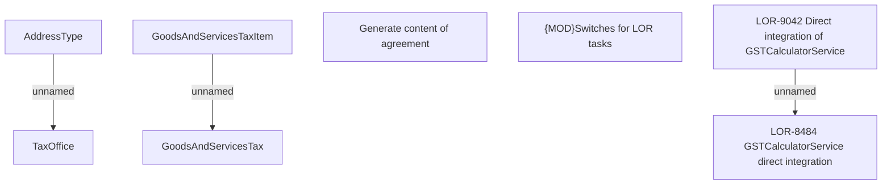

# LOR-8484 GSTCalculatorService direct integration

```mermaid
graph TD
    TaxOffice["TaxOffice"]
    AddressType["AddressType"]
    GoodsAndServicesTaxItem["GoodsAndServicesTaxItem"]
    GoodsAndServicesTax["GoodsAndServicesTax"]
    Generate_content_of_agreement["Generate content of agreement"]
    MOD_Switches_for_LOR_tasks["{MOD}Switches for LOR tasks"]
    LOR_9042_Direct_integration_of_GSTCalculatorService["LOR-9042 Direct integration of GSTCalculatorService"]
    LOR_8484_GSTCalculatorService_direct_integration["LOR-8484 GSTCalculatorService direct integration"]
    LOR_9042_Direct_integration_of_GSTCalculatorService -->|unnamed| LOR_8484_GSTCalculatorService_direct_integration
    GoodsAndServicesTaxItem -->|unnamed| GoodsAndServicesTax
    AddressType -->|unnamed| TaxOffice
```
