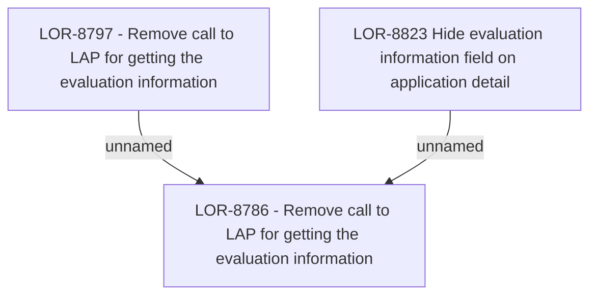

# LOR-8786 - Remove call to LAP for getting the evaluation information

```mermaid
graph TD
    LOR_8823_Hide_evaluation_information_field_on_application_de["LOR-8823 - Hide evaluation information field on application detail"]
    LOR_8797_Remove_call_to_LAP_for_getting_the_evaluation_infor["LOR-8797 - Remove call to LAP for getting the evaluation information"]
    LOR_8797_Remove_call_to_LAP_for_getting_the_evaluation_infor["LOR-8797 - Remove call to LAP for getting the evaluation information"]
    LOR_8823_Hide_evaluation_information_field_on_application_de["LOR-8823 Hide evaluation information field on application detail"]
    LOR_8786_Remove_call_to_LAP_for_getting_the_evaluation_infor["LOR-8786 - Remove call to LAP for getting the evaluation information"]
    LOR_8797_Remove_call_to_LAP_for_getting_the_evaluation_infor -->|unnamed| LOR_8786_Remove_call_to_LAP_for_getting_the_evaluation_infor
    LOR_8823_Hide_evaluation_information_field_on_application_de -->|unnamed| LOR_8786_Remove_call_to_LAP_for_getting_the_evaluation_infor
```
