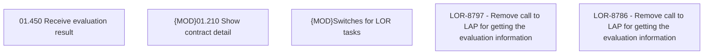

# LOR-8797 - Remove call to LAP for getting the evaluation information

- **Diagram Type**: Custom
- **Package**: HomerSelect/BSL/Requirements Model/Finished/LOR/LOR-8786 - Remove call to LAP for getting the evaluation information/LOR-8797 - Remove call to LAP for getting the evaluation information
- **Diagram ID**: 148715
- **Elements**: 5
- **Connectors**: 0

