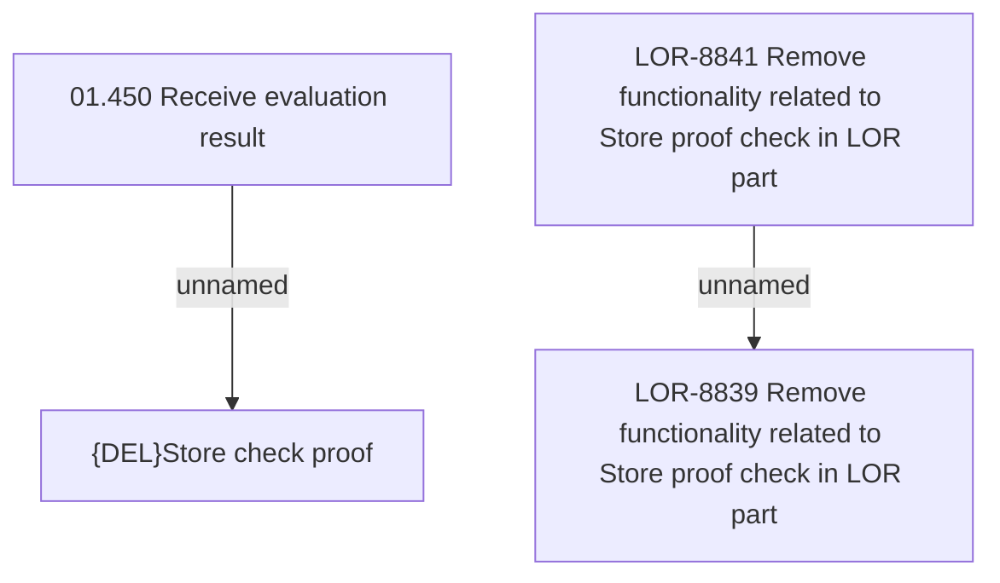

# LOR-8839 Remove functionality related to Store proof check in LOR part

- **Diagram Type**: Custom
- **Package**: HomerSelect/BSL/Requirements Model/Finished/LOR/LOR-8839 Remove functionality related to Store proof check in LOR part
- **Diagram ID**: 149616
- **Elements**: 4
- **Connectors**: 2

